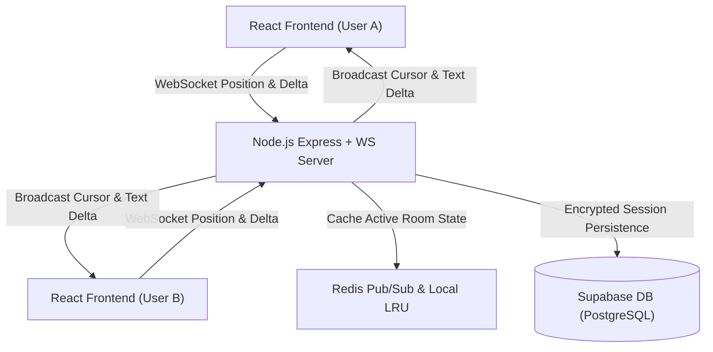
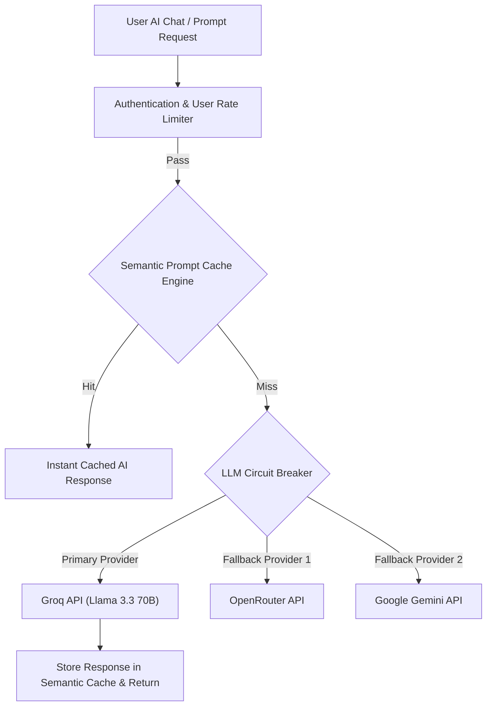
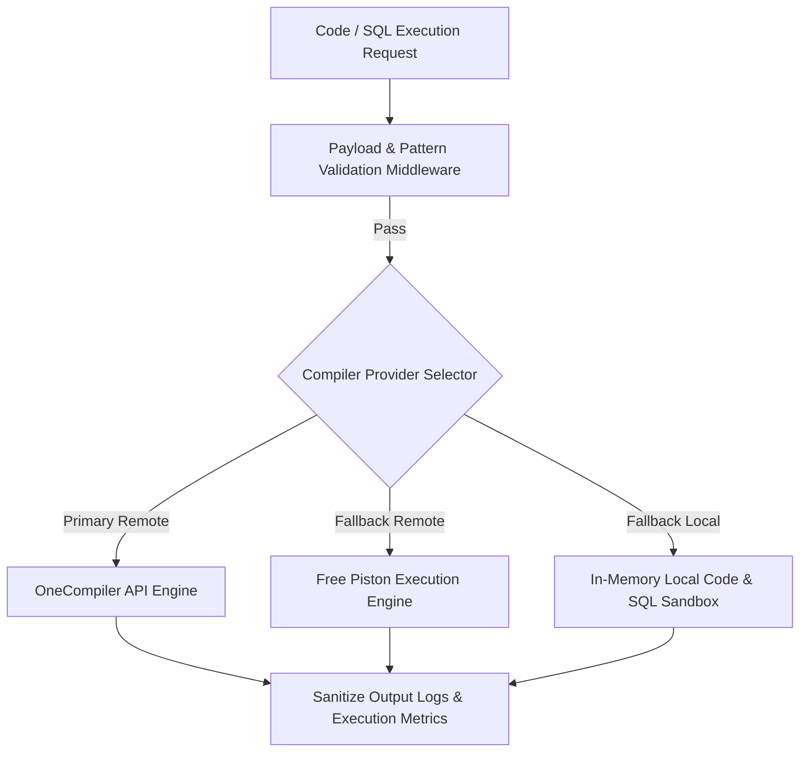

# CodeX

<p align="center">
  
  
  
  
  
  
</p>

A high-performance, web-based collaborative code editor, AI copilot, and multi-language execution platform.

---

## ✨ Features

- **Code Editor**: CodeMirror 6 integration with multi-language syntax highlighting, themes, and Vim/Emacs keymap support.
- **Multi-Language Code Execution**: Run code in 60+ programming languages via OneCompiler API, Piston fallback, or local sandbox.
- **AI Copilot & Chat**: Context-aware AI completion, refactoring, and troubleshooting powered by a multi-provider LLM chain with circuit breaker and semantic caching.
- **Real-Time Collaboration**: Multi-user room collaboration with remote cursor indicators, position deltas, and shared canvas whiteboard.
- **SQL Playground & Database Engine**: Built-in SQL statement runner with table output rendering and relational syntax assistance.
- **Enterprise Security**: User ID-keyed rate limiting, AES-256 field encryption, Helmet headers, CORS policies, and non-blocking security audit logging.

---

## 🏗️ System Architecture

### 1. Real-Time Collaborative Editor Architecture


### 2. AI Copilot, Circuit Breaker & Semantic Cache Architecture


### 3. Code Execution Engine & SQL Playground Architecture


---

## 🛠️ Tech Stack

- **Frontend**: React 18, CodeMirror 6, Framer Motion, Tldraw, Vanilla CSS
- **Backend**: Node.js, Express, WebSockets (`ws`), `rate-limiter-flexible`, Redis
- **Database & Auth**: Supabase (PostgreSQL) with AES-256 Encryption
- **Containerization**: Docker, Nginx, Docker Compose

---

## 🚀 Quickstart

### Prerequisites
- Node.js (v18+)
- npm (v9+)

### Installation

1. Clone the repository:
   ```bash
   git clone https://github.com/dhruvmkolhe/codeX.git
   cd codeX
   ```

2. Install dependencies:
   ```bash
   npm install
   ```

3. Set up environment variables:
   Create a `.env` file in the root directory:
   ```env
   PORT=5001
   GROQ_API_KEY=your_groq_api_key
   REACT_APP_SUPABASE_URL=your_supabase_url
   REACT_APP_SUPABASE_ANON_KEY=your_supabase_anon_key
   ```

4. Start the development server:
   ```bash
   npm start
   ```
   - Frontend: `http://localhost:3000`
   - Backend: `http://localhost:5001`

---

## 🧪 Running Tests

Run the complete test suite across frontend, backend, and infrastructure:
```bash
npm run test:all
```

Or run individual test suites:
- Frontend: `npm test`
- Backend: `npm run test:backend`
- Infrastructure: `npm run test:infrastructure`

---

## 🐳 Docker Deployment

To run using Docker Compose:
```bash
docker compose up --build
```
Access the application at `http://localhost:8080`.

---

## 📄 License & Policies

- **License**: [MIT](LICENSE)
- **Security Policy**: [SECURITY.md](SECURITY.md)
- **Version History**: [CHANGELOG.md](CHANGELOG.md)
- **Product Roadmap**: [ROADMAP.md](ROADMAP.md)
